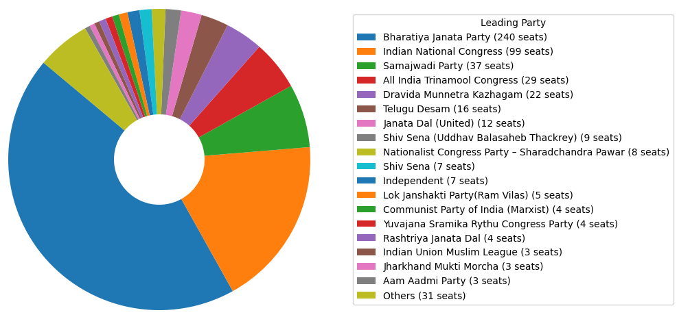

# India Election 2024 🗳️

This project analyzes the complete results of the 2024 Lok Sabha Elections, sourced from the Election Commission of India's official website and available on Kaggle. The dataset provides comprehensive insights into the election outcomes, featuring details of each parliamentary constituency, leading candidates, their parties, margin of victory, and result status.

## 📊 Dataset Description
The dataset includes the following columns:

- **Constituency:** The name of the parliamentary constituency.
- **Const. No.:** Unique identifier assigned to each constituency.
- **Leading Candidate:** Name of the candidate with the highest votes in the constituency.
- **Leading Party:** Political party of the leading candidate.
- **Trailing Candidate:** Name of the candidate with the second-highest votes.
- **Trailing Party:** Political party of the trailing candidate.
- **Margin:** Number of votes by which the leading candidate won.
- **Status:** Result status (e.g., "Result Declared").

## 🎯 Project Objective
The objective of this project is to conduct an in-depth analysis of the election results to uncover significant insights and trends. Key areas of exploration include:

- 📊 Distribution of leading parties across constituencies.
- 🏅 Margin of victory in different constituencies.
- 📈 Comparison between leading and trailing parties.
- 📢 Status of election results.

## 📑 Steps Followed
1. **Data Collection:** Obtained dataset from Kaggle.
2. **Data Preprocessing and EDA:** Cleaned data and performed exploratory data analysis.
3. **Data Visualization:** Visualized insights using graphs and charts.
4. 
## Tools Used
- Python (Pandas, NumPy, Matplotlib, Seaborn)

## 🔗 Kaggle Dataset Link
[Kaggle Dataset - India Election 2024](https://www.kaggle.com/datasets/nuhmanpk/india-lok-sabha-election-results-2024/data)

## Author

Fathima Thanseeha

#### 🚀Feel free to explore the interactive project in Google Colab: [Open in Google Colab](https://colab.research.google.com/drive/1mVnPRAy6NMRVvcZztvMAQWb5AaPREite#scrollTo=m_NoqI53HirW)

